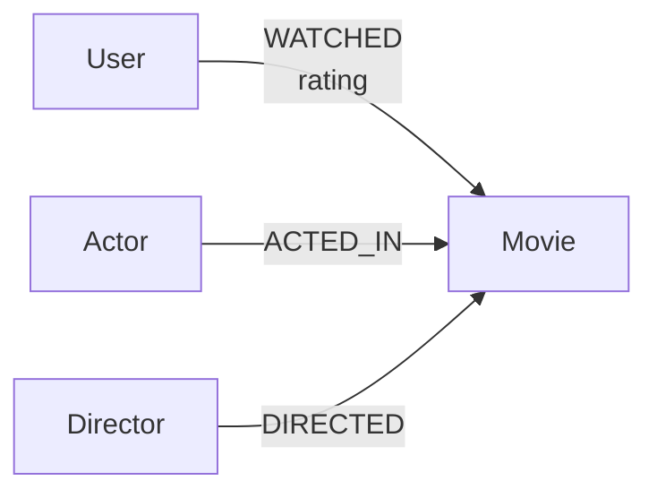
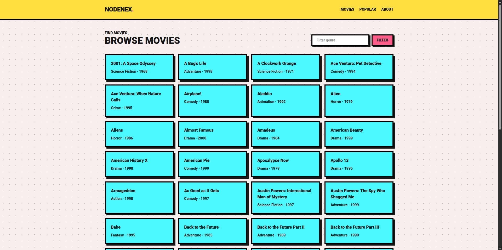
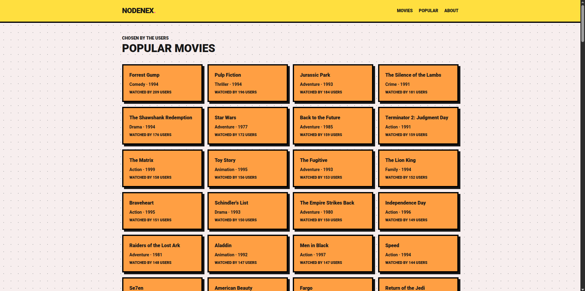
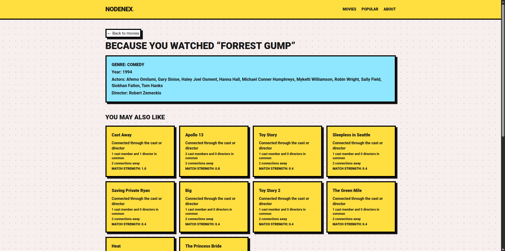
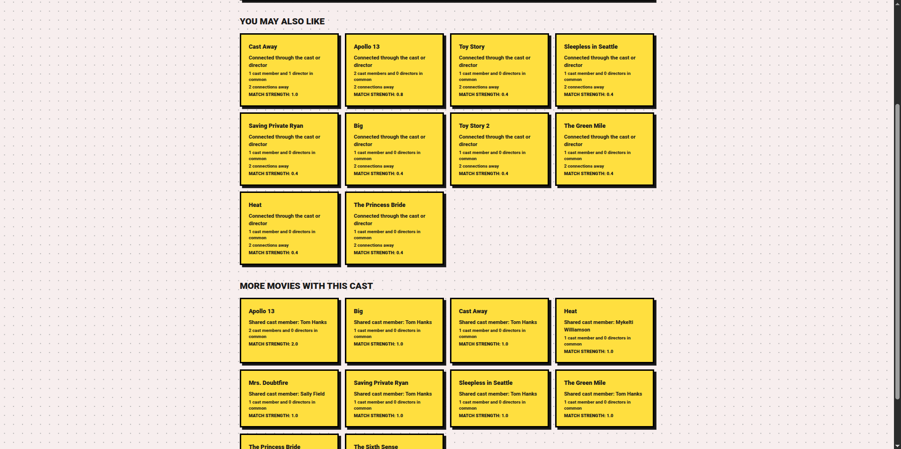
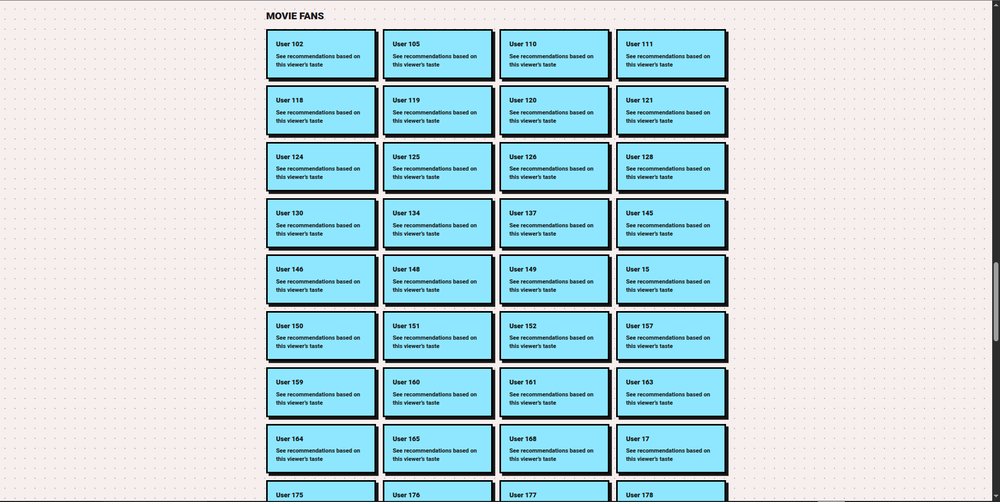
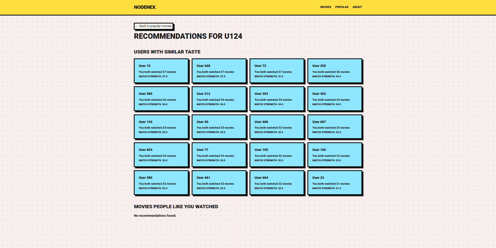

# Nodenex

Nodenex is a movie recommendation application backed by CognoDB. Laravel
handles HTTP requests and the `GraphService` sends parameterized openCypher
queries through the Laudis Neo4j Bolt client.

## Why a graph database?

Nodenex's useful question is not just “which movies have this genre?” It is
“which movies are connected to this movie through actors and directors?”
That is a relationship-first question, which is where a graph database is a
natural fit.

For example, a recommendation can follow this path:

```text
Movie A -> Actor 1 -> Movie B
```

CognoDB traverses each adjacent relationship directly. The query describes
the path once:

```cypher
MATCH (actor:Actor)-[:ACTED_IN]->(seed:Movie {title: $movieTitle})
MATCH (actor)-[:ACTED_IN]->(candidate:Movie)
```

The database can then count how many actors bridge two movies and rank
candidates by relevance while preserving the relationship context.

SQL can keep up closely for simple lookups and fixed-depth joins. A one-hop
movie-to-movie lookup can join movies to a movie-actor pivot table and back
to movies, especially when the relevant columns are indexed. The challenge is
not that SQL cannot answer graph-like questions; it is that the query becomes
overly complex as more relationship types are blended together.

Combining actor overlap and director overlap into a single ranked result, as
Nodenex's movie recommendation query does, requires more table aliases and
repeated self-joins in SQL — one join path per relationship type, plus logic
to keep rows where only one of the two signals is present. Each extra join
can also expand intermediate result sets before the final candidates are
filtered. The resulting SQL is harder to read, change, and maintain, even
when a carefully indexed relational database still performs well.

A graph stores the adjacency directly, so traversal follows the relationships
that actually exist. CognoDB can return shared actor/director counts and the
connecting name as part of the query result, without requiring the
application to reconstruct the path. The advantage Nodenex demonstrates is
therefore primarily about modeling and query complexity, with performance
benefits for relationship-heavy workloads depending on the graph size,
indexes, and query plan.

Nodenex demonstrates this advantage with the same traversal pattern across
movie networks and user taste networks. The graph is not being used merely as
another place to store movie rows; it is used to answer questions about
connections that become awkward to model as a growing collection of joins.

## Setup

### 1. Create a CognoDB instance

Sign up at [console.cognodb.com/signup](https://console.cognodb.com/signup).
The free tier requires no credit card.

Create a free `c0` instance and choose a region. Copy the connection details
immediately: CognoDB provides a `bolt+s://` URI, the username `cognodb`, and a
generated password.

### 2. Configure Nodenex

Install PHP 8.3+, Composer, Node.js/npm, and Python 3.10+. Then from the
project directory run:

```bash
composer install
npm install
cp .env.example .env
php artisan key:generate
```

Fill in `.env`:

```env
COGNODB_URI=bolt+s://<instance-id>.databases.cognodb.com
COGNODB_USER=cognodb
COGNODB_PASSWORD=<the-password-shown-once>
COGNODB_RETRIES=3
COGNODB_RETRY_DELAY_MS=250
```

`.env` is gitignored. Nothing in the repository should contain real
credentials.

### 3. Verify the application connection

Start Laravel:

```bash
php artisan serve
```

Open [http://127.0.0.1:8000](http://127.0.0.1:8000), then browse to `/home`.
The application reads the existing graph through `GraphService`. If CognoDB
cannot be reached, the UI displays a safe connection message and Laravel logs
the technical error in `storage/logs/laravel.log`.

### 4. Load the graph

The graph is already loaded for the current project. Do not run the seeder
unless you intentionally want to add or refresh data.

To seed manually:

```bash
tar -xzf seeders/datasets.tar.gz -C seeders
python3 -m venv .venv
source .venv/bin/activate
pip install pandas neo4j python-dotenv
python seeders/seed_cognodb.py
```

The archive restores the four CSV datasets required by the seeder in the
`seeders/` directory.

The loader selects 500 valid rated movies, active users, and the first 10
billed actors per movie. It uses `MERGE`, so rerunning it does not duplicate
matching nodes or relationships. It does not delete old data.

**Note**
The dataset in this project is a modified version where the data reduced to personal
hardware limitations during the seeding process

You can get the original dataset through this link:
https://www.kaggle.com/datasets/rounakbanik/the-movies-dataset?resource=download

### 5. Build and run the UI

For a production-style asset build:

```bash
npm run build
php artisan serve
```

During development, use two terminals:

```bash
npm run dev
php artisan serve
```

## Data Model Diagram



The seeded graph contains `Movie`, `Actor`, `Director`, and `User` nodes with
typed `WATCHED`, `ACTED_IN`, and `DIRECTED` relationships. Movie properties
are `id`, `title`, `year`, and `genre`. People have `id` and `name`. The
queries in this document match movies by `title` and users by `id`; the
`Movie.id` property is stored for reference and future use but isn't used as
a match key by any query documented here.

## Routes and user flow

| Route             | Purpose                                            |
| ----------------- | -------------------------------------------------- |
| `/`               | Landing page                                       |
| `/home`           | Genre-filterable movie browser                     |
| `/movies/{title}` | Movie details and graph recommendations            |
| `/users`          | Popular movies ranked by user watches              |
| `/users/{id}`     | Similar-user recommendations                       |
| `/about`          | Architecture summary and plain-language dictionary |

## Recent updates

- Movie recommendations now explain why they appear by showing shared cast or
  director connections, viewer support, connection distance, and match
  strength when those values are available.
- Movie pages list the full available cast instead of stopping after one actor.
- User recommendations show shared viewing history and how many similar viewers
  helped surface a movie.
- The Popular page now includes a list of viewers whose profiles can be opened
  for personalized recommendations.
- The About page has a responsive two-column layout: the Nodenex overview is
  on the left and a dictionary is on the right. The dictionary explains labels
  such as “shared cast member,” “match strength,” and “connections away” in
  plain language.
- The match-strength dictionary includes guide ranges: `0–0.9` is a light
  connection, `1–1.9` is a good connection, and `2+` is a strong connection.
  These values are comparison guides, not a score out of 10.

Every movie card links back to `/movies/{title}`, allowing recommendations to
be explored recursively. Empty recommendation sections show an explicit empty
state. CognoDB failures are retried, logged, and shown as a safe connection
message instead of exposing credentials or stack traces.

When a page is navigating to a CognoDB-backed result, Nodenex displays a
full-page “Loading graph data...” state. This keeps the interface clear while
the server performs the graph query and is also used when submitting the genre
filter form.

## Screenshots

The screenshots below show the main Nodenex user journey. They use the updated
Nodenex branding and the current responsive visual style.

### Landing page


### Browse movies



### Popular movies



### Movie details and recommendations





### Users who watched movies

- Not recommended for a real app. This is just to simulate what a user would see.



### Movie with similar taste



## Cypher queries that exercise the graph

Nodenex's core behavior is driven by Cypher queries that traverse the graph,
not by isolated movie lookups. All queries are parameterized; no user input is
concatenated into Cypher.

### Movies connected through shared actors

```cypher
MATCH (seed:Movie {title: $movieTitle})
MATCH (actor:Actor)-[:ACTED_IN]->(seed)
MATCH (actor)-[:ACTED_IN]->(candidate:Movie)

WHERE candidate <> seed

WITH candidate,
    count(DISTINCT actor) AS sharedActors,
    collect(DISTINCT actor.name) AS actors

RETURN candidate.title AS title,
    sharedActors,
    toFloat(sharedActors) AS relevanceScore,
    actors[0] AS connectorName,
    'Actor' AS connectorType

ORDER BY sharedActors DESC, title ASC
LIMIT $limit
```

**How it works:** starting from a seed movie, this finds every `Actor` who
`ACTED_IN` that movie, then finds every other movie (`candidate`) that same
actor also `ACTED_IN` — a single-hop "actors in common" traversal. `WHERE
candidate <> seed` excludes the seed movie from its own results, since an
actor in the seed movie trivially "shares" it with itself.

`count(DISTINCT actor)` counts how many _different_ actors bridge the seed
and the candidate — a movie sharing three cast members with the seed ranks
higher than one sharing just one. `collect(DISTINCT actor.name)` gathers all
the bridging actors' names into a list, and `actors[0]` picks the first one
as a representative "connector" to show in the UI — this is a display
simplification, not necessarily "the most important" shared actor, since the
list order isn't guaranteed to reflect relevance.

`relevanceScore` here is just `sharedActors` cast to a float — a simple,
un-decayed count rather than a weighted formula. Results are sorted by that
count, with title as a tiebreaker for stable, deterministic ordering.

---

### Movie recommendations blending actors and directors

```cypher
MATCH (seed:Movie {title: $movieTitle})
OPTIONAL MATCH (seed)<-[:ACTED_IN]-(a:Actor)-[:ACTED_IN]->(candidate:Movie)
WHERE candidate <> seed
WITH seed, candidate, count(DISTINCT a) AS sharedActors

OPTIONAL MATCH (seed)<-[:DIRECTED]-(d:Director)-[:DIRECTED]->(candidate)
WITH seed, candidate, sharedActors, count(DISTINCT d) AS sharedDirectors

WHERE candidate IS NOT NULL

RETURN
    candidate.title AS title,
    sharedActors,
    sharedDirectors,
    2 AS distance,
    (
        sharedActors * 0.4 +
        sharedDirectors * 0.6
    ) AS relevanceScore
ORDER BY relevanceScore DESC
LIMIT $limit;
```

**How it works:** this is a more sophisticated version of the actor-sharing
query above — it combines two independent signals (shared cast and shared
crew) into one ranked list.

Both hops use `OPTIONAL MATCH` rather than `MATCH`. This matters: a plain
`MATCH` would require _both_ an actor-overlap path _and_ a director-overlap
path to exist for a candidate to appear at all, silently dropping any movie
that only shares a director (or only shares an actor). `OPTIONAL MATCH`
instead lets either side come back empty without eliminating the row — a
missing match just contributes `count(DISTINCT a) = 0` or
`count(DISTINCT d) = 0` rather than removing the candidate outright.

The query runs the actor hop first and folds it into `sharedActors` via the
first `WITH`, carrying `seed` and `candidate` forward so the second
`OPTIONAL MATCH` can reuse them for the director hop. This two-stage
`OPTIONAL MATCH` → `WITH` → `OPTIONAL MATCH` pattern is how Cypher chains
independent optional lookups without one search silently constraining the
other.

`WHERE candidate IS NOT NULL` guards against the edge case where _neither_
optional match found anything — `OPTIONAL MATCH` can still produce a row with
`candidate` bound to `null` if no path existed at all, and this filters those
out.

`relevanceScore` is a weighted blend: `sharedActors * 0.4 + sharedDirectors *
0.6` — director overlap counts for more than actor overlap here (a 1.5x
weight), reflecting a judgment call that sharing a director is a stronger
signal of similar style/tone than sharing a cast member. `distance: 2` is a
hardcoded label marking this candidate as reachable within two relationship
hops (Movie → Actor/Director → Movie), useful if the application merges
recommendations from multiple strategies in a blended results view.

---

### Users with similar taste

```cypher
MATCH (seed:User {id: $userId})-[:WATCHED]-(shared:Movie)-[:WATCHED]-(other:User)
WHERE other <> seed
WITH other, count(DISTINCT shared) AS sharedMovies
RETURN other.name AS name, sharedMovies,
       toFloat(sharedMovies) AS relevanceScore
ORDER BY relevanceScore DESC, sharedMovies DESC, name
LIMIT $limit
```

**How it works:** a 2-hop traversal that finds "taste neighbors" rather than
movie recommendations directly. From the `seed` user, it walks out to every
movie they've `WATCHED`, then back in to every `other` user who also watched
that movie. `other <> seed` excludes the seed user from being counted as
their own neighbor (which the undirected `-[:WATCHED]-` pattern would
otherwise allow, since the path could loop back through `seed`).

`count(DISTINCT shared)` tallies how many _different_ movies each `other`
user has in common with `seed` — someone who overlaps on five movies is a
much stronger taste match than someone who overlaps on one, and `DISTINCT`
ensures a single shared movie isn't somehow counted more than once. As in
the actor query above, `relevanceScore` is just that count cast to a float,
with `sharedMovies` and `name` as tiebreakers for stable ordering.

Note that `$userId` here is bound directly as a string parameter — since
`User.id` values are stored as strings (e.g. `"u7"`), the caller
(`similarUsers(string $userId, ...)`) must pass the id in that same string
form, not as a bare integer, or this match will silently return nothing.

---

### Recommended movies from similar users

```cypher
MATCH (seed:User {id: $userId})-[:WATCHED]-(shared:Movie)-[:WATCHED]-(other:User)-[:WATCHED]-(candidate:Movie)
WHERE other <> seed AND NOT (seed)-[:WATCHED]-(candidate)
WITH candidate, count(DISTINCT other) AS pathCount
RETURN candidate.title AS title, 3 AS distance, pathCount,
       toFloat(pathCount) AS relevanceScore
ORDER BY relevanceScore DESC, pathCount DESC, title
LIMIT $limit
```

**How it works:** this extends the "similar users" query one hop further to
get actual movie recommendations, rather than a list of similar people. It's
the classic collaborative-filtering chain: `seed` → movies they watched
(`shared`) → other users who also watched those (`other`) → movies _those_
users watched (`candidate`).

`other <> seed` again prevents the seed user from looping back through
themselves via the undirected `WATCHED` edges. `NOT (seed)-[:WATCHED]-(candidate)`
excludes anything the seed user has already watched, since the goal is to
surface something new.

`count(DISTINCT other)` scores each candidate by how many _distinct_ taste
neighbors watched it — a movie that five different similar users watched
outranks one that only a single similar user watched. `distance: 3` is a
hardcoded label marking this candidate as reachable within three relationship
hops (User → Movie → User → Movie), paired with `distance: 2` in the
actor/director movie query above so the application can tag which strategy
produced each row when merging results. Sorting falls back from
`relevanceScore` to raw `pathCount` to `title` for deterministic ordering
when scores tie.

This query is prone to returning empty results for users who have already
watched a large fraction of the catalog: if none of a user's taste neighbors
happen to have watched anything that user hasn't already seen, the `NOT`
filter eliminates every candidate. In that situation a popularity-based
fallback (e.g. `popularMoviesByUsers`) is a reasonable substitute, since
collaborative filtering has no signal left to offer.

---

### Notes on the implementation (`GraphService::run`)

All of the above queries are executed through a shared `run()` method that
wraps the actual Neo4j client call in a retry loop (`$this->retries`,
default 3 attempts, with an increasing delay between each). If every attempt
fails, the error is logged and the method returns an empty array rather than
throwing — callers get an empty result set plus a message available via
`GraphService::error()`, rather than an exception bubbling up. This means an
empty array from any of these methods can mean either "no matches" or
"the database call failed" — worth checking `error()` when a result looks
unexpectedly empty.

See [`docs/cypher/core-queries.cypher`](docs/cypher/core-queries.cypher) for the
complete workbook and parameters.

## Verification

```bash
php artisan view:cache
php artisan test
npm run build
```

The direct database validation checklist is in
[`docs/query-validation.md`](docs/query-validation.md). Use `PROFILE` in Neo4j
Browser to inspect index seeks and record live CognoDB timings.
