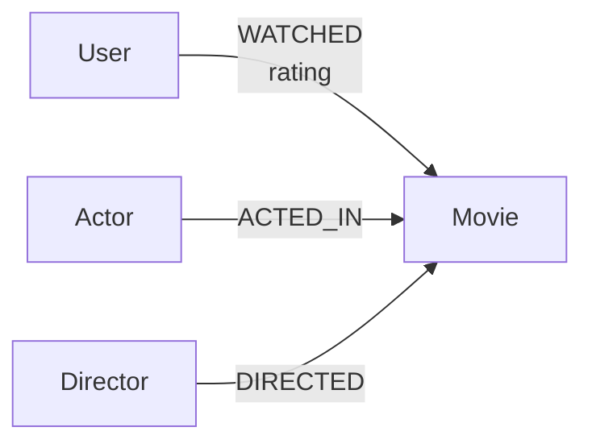

# Graphflix

Graphflix is a movie recommendation application backed by CognoDB. Laravel
handles HTTP requests and the `GraphService` sends parameterized openCypher
queries through the Laudis Neo4j Bolt client.

## Why a graph database?

Graphflix's useful question is not just “which movies have this genre?” It is
“which movies are connected to this movie through actors and directors within a
bounded number of hops?” That is a relationship-first question, which is where
a graph database is a natural fit.

For example, a four-hop recommendation can follow this path:

```text
Movie A -> Actor 1 -> Movie B -> Actor 2 -> Movie C
```

CognoDB traverses each adjacent relationship directly. The query describes the
path once with a variable-length pattern:

```cypher
MATCH p=(seed:Movie {title: $movieTitle})-[:ACTED_IN|DIRECTED*3..6]-(candidate:Movie)
```

The database can then calculate the path distance, count alternative paths,
and rank candidates by relevance while preserving the relationship context.

SQL can keep up closely for simple lookups and fixed-depth joins. A two-hop
movie-to-movie lookup can join movies to a movie-actor pivot table and back to
movies, especially when the relevant columns are indexed. The challenge is
not that SQL cannot answer graph-like questions; it is that the query becomes
overly complex as the number of hops grows.

Extending the same request to four or six hops requires more table aliases and
repeated self-joins. If the depth is variable, the SQL solution usually needs
a recursive CTE or application-side loops that issue more queries and rebuild
paths manually. Each extra join can also expand intermediate result sets before
the final candidates are filtered. The resulting SQL is harder to read,
change, and maintain, even when a carefully indexed relational database still
performs well.

A graph stores the adjacency directly, so traversal follows the relationships
that actually exist. CognoDB can return hop distance, path count, and the
connecting actor or director as part of the query result, without requiring the
application to reconstruct the path. The advantage Graphflix demonstrates is
therefore primarily about modeling and query complexity, with performance
benefits for relationship-heavy workloads depending on the graph size,
indexes, and query plan.

Graphflix demonstrates this advantage with the same traversal pattern across
movie networks and user taste networks. The graph is not being used merely as
another place to store movie rows; it is used to answer questions about
connections that become awkward to model as a growing collection of joins.

## Setup

### 1. Create a CognoDB instance

Sign up at [console.cognodb.com/signup](https://console.cognodb.com/signup).
The free tier requires no credit card.

Create a free `c0` instance and choose a region. Copy the connection details
immediately: CognoDB provides a `bolt+s://` URI, the username `cognodb`, and a
generated password.

### 2. Configure Graphflix

Install PHP 8.3+, Composer, Node.js/npm, and Python 3.10+. Then from the
project directory run:

```bash
composer install
npm install
cp .env.example .env
php artisan key:generate
```

Fill in `.env`:

```env
COGNODB_URI=bolt+s://<instance-id>.databases.cognodb.com
COGNODB_USER=cognodb
COGNODB_PASSWORD=<the-password-shown-once>
COGNODB_RETRIES=3
COGNODB_RETRY_DELAY_MS=250
```

`.env` is gitignored. Nothing in the repository should contain real
credentials.

### 3. Verify the application connection

Start Laravel:

```bash
php artisan serve
```

Open [http://127.0.0.1:8000](http://127.0.0.1:8000), then browse to `/home`.
The application reads the existing graph through `GraphService`. If CognoDB
cannot be reached, the UI displays a safe connection message and Laravel logs
the technical error in `storage/logs/laravel.log`.

### 4. Load the graph

The graph is already loaded for the current project. Do not run the seeder
unless you intentionally want to add or refresh data.

To seed manually:

```bash
tar -xzf seeders/datasets.tar.gz -C seeders
python3 -m venv .venv
source .venv/bin/activate
pip install pandas neo4j python-dotenv
python seeders/seed_cognodb.py
```

The archive restores the four CSV datasets required by the seeder in the
`seeders/` directory.

The loader selects 500 valid rated movies, active users, and the first 10
billed actors per movie. It uses `MERGE`, so rerunning it does not duplicate
matching nodes or relationships. It does not delete old data.

### 5. Build and run the UI

For a production-style asset build:

```bash
npm run build
php artisan serve
```

During development, use two terminals:

```bash
npm run dev
php artisan serve
```

## Data Model Diagram



The seeded graph contains `Movie`, `Actor`, `Director`, and `User` nodes with
typed `WATCHED`, `ACTED_IN`, and `DIRECTED` relationships. Movie properties are
`id`, `title`, `year`, and `genre`; people have `id` and `name`.

## Routes and user flow

| Route | Purpose |
|---|---|
| `/` | Landing page |
| `/home` | Genre-filterable movie browser |
| `/movies/{title}` | Movie details and graph recommendations |
| `/users` | Popular movies ranked by user watches |
| `/users/{id}` | Similar-user recommendations |
| `/about` | Architecture summary |

Every movie card links back to `/movies/{title}`, allowing recommendations to
be explored recursively. Empty recommendation sections show an explicit empty
state. CognoDB failures are retried, logged, and shown as a safe connection
message instead of exposing credentials or stack traces.

## Screenshots

The screenshots below show the main user journey through the application.

### 1. Landing page

The landing page introduces Graphflix and sends a visitor directly to the movie
browser. The bright yellow navigation and blue hero panel establish the
Neo-Brutalist visual language used throughout the app.


### 2. Browse movies

The browse screen displays the 500 seeded movies as clickable white cards. Each
card shows the title, genre, and release year, while the genre field filters the
available movie set.


### 3. Popular movies

The Popular page ranks movies by the number of users who watched them. Orange
cards make the ranking distinct from the general movie browser, and selecting
any card opens the same movie detail and recommendation flow.


### 4. Movie details and recommendations

The movie detail page shows the selected movie's genre, year, actors, and
director, followed by two graph-powered sections. The first contains deeper
network recommendations, and the second shows other movies connected through
actors. Each yellow recommendation card is clickable and includes its graph
distance in hops.


When a page is navigating to a CognoDB-backed result, Graphflix displays a
full-page “Loading graph data...” state. This keeps the interface clear while
the server performs the graph query and is also used when submitting the genre
filter form.

## Cypher queries that exercise the graph

Graphflix's core behavior is driven by Cypher queries that traverse the graph,
not by isolated movie lookups. All queries are parameterized; no user input is
concatenated into Cypher.

### Multi-hop movie traversal

This query follows actor and director relationships for two or more hops. The
variable-length pattern lets CognoDB discover connected movies without the
application writing a separate join for every possible hop:

```cypher
MATCH p=(seed:Movie {title: $movieTitle})-[:ACTED_IN|DIRECTED*2..4]-(candidate:Movie)
WHERE candidate <> seed
RETURN candidate.title AS title,
       min(length(p)) AS distance,
       count(p) AS pathCount
ORDER BY distance ASC, pathCount DESC, title
LIMIT $limit
```

Deeper movie recommendations use a variable-length actor/director traversal:

```cypher
MATCH (seed:Movie {title: $movieTitle})
MATCH p=(seed)-[:ACTED_IN|DIRECTED*3..6]-(candidate:Movie)
WHERE candidate <> seed
  AND length(p) >= $minDistance
  AND length(p) <= $maxDistance
WITH candidate, p, nodes(p)[1].name AS connectorName,
     labels(nodes(p)[1])[0] AS connectorType
WITH candidate, min(length(p)) AS distance, count(p) AS pathCount,
     collect(DISTINCT connectorName)[0] AS connectorName,
     collect(DISTINCT connectorType)[0] AS connectorType
RETURN candidate.title AS title, distance, pathCount,
       (1.0 / toFloat(distance)) * log10(1.0 + toFloat(pathCount)) AS relevanceScore,
       connectorName, connectorType
ORDER BY relevanceScore DESC, pathCount DESC, distance ASC, title
LIMIT $limit
```

The actor-only section uses the same shape but only `ACTED_IN` relationships.
User recommendations use a longer shared-taste traversal:

```cypher
MATCH (selected:User {id: $userId})-[:WATCHED]->(shared:Movie)
      <-[:WATCHED]-(similar:User)-[:WATCHED]->(recommendation:Movie)
WHERE similar <> selected
  AND NOT (selected)-[:WATCHED]->(recommendation)
WITH recommendation, count(DISTINCT similar) AS similarUsers
RETURN recommendation.title AS title, similarUsers
ORDER BY similarUsers DESC, title
LIMIT $limit
```

The shared-taste query is especially awkward in a relational database: it
requires multiple self-joins through the watch table, exclusion logic, and
deduplication of intermediate users. In the graph, the connected path is
expressed directly and the query can rank recommendations by the number of
similar users. See
[`docs/cypher/core-queries.cypher`](docs/cypher/core-queries.cypher) for the
complete workbook and parameters.

## Verification

```bash
php artisan view:cache
php artisan test
```

The direct database validation checklist is in
[`docs/query-validation.md`](docs/query-validation.md). Use `PROFILE` in Neo4j
Browser to inspect index seeks and record live CognoDB timings.
